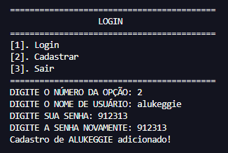

# JOKENPÔ EM PYTHON!
Este projeto é uma implementação simples e divertida do jogo Pedra, Papel e Tesoura, onde você pode desafiar o computador. Desenvolvido em Python, ele serve como um ótimo exemplo de como criar jogos interativos básicos com lógica condicional. Ideal para iniciantes em programação que desejam aprender de forma prática.

### FUNCIONALIDADES
- **Jogo Interativo:** O usuário pode jogar contra o computador.  

- **Escolhas do Jogador:** O jogador escolhe entre Pedra, Papel ou Tesoura.  
- **Resultados Automáticos:** O programa determina automaticamente o vencedor com base nas regras do jogo.  
- **Sistema de Pontos** O usuário pode obter pontos por vitórias ou perder pontos pelas derrotas.  
- **Sistema de Ranking** O programa faz um ranking de acordo com as pontuações obtidas pelo usuário.  
- **Sistema de Login:** O usuário precisa se cadastrar e fazer login para jogar.  
- **Repetição do Jogo:** Permite jogar múltiplas rodadas sem reiniciar o programa.  