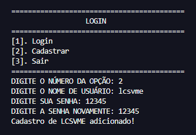
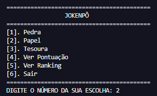
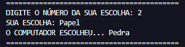
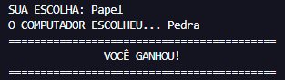
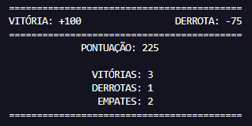
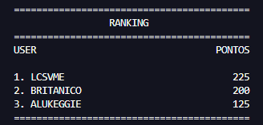

<h1><b>JOKENPÔ EM PYTHON!</b></h1>

Este projeto é uma implementação simples e divertida do jogo Pedra, Papel e Tesoura, onde você pode desafiar o computador. Desenvolvido em Python, ele serve como um ótimo exemplo de como criar jogos interativos básicos com lógica condicional. Ideal para iniciantes em programação que desejam aprender de forma prática.

O 'pythonJokenpo' inclui um sistema de salvamento de dados que permite armazenar e recuperar informações do jogo, como pontuações e resultados, em um arquivo de texto. Esse sistema é implementado no arquivo 'arquivo.py'.

<h2>FUNCIONALIDADES</h2>
        <h3><b>- SISTEMA DE LOGIN</b></h3>
        
        
O usuário precisa se cadastrar e fazer login para jogar.

<h3><b>- JOGO INTERATIVO</b></h3>

O usuário pode jogar contra o computador.

<h3><b>- ESCOLHAS DO JOGADOR:</b></h3>

O jogador escolhe entre Pedra, Papel ou Tesoura.

<h3><b>- RESULTADOS AUTOMÁTICOS</b></h3>

O programa determina automaticamente o vencedor com base nas regras do jogo.

<h3><b>- SISTEMA DE PONTOS</b></h3>

O usuário pode obter pontos por vitórias ou perder pontos pelas derrotas.

<h3><b>- SISTEMA DE RANKING</b></h3>

O programa faz um ranking de acordo com as pontuações obtidas pelo usuário.

<h3><b>REPETIÇÃO DO JOGO</b></h3>

Permite jogar múltiplas rodadas sem reiniciar o programa.

